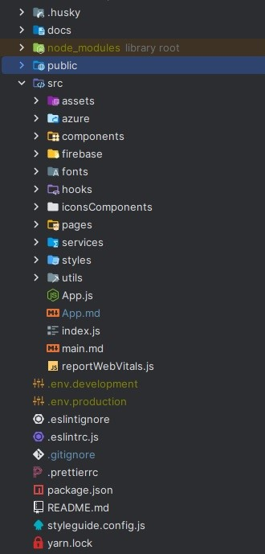
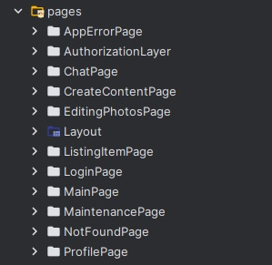
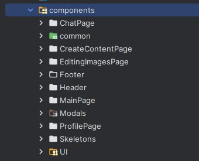

# Application Folder Structure

## Introduction

This documentation provides an overview of the folder structure of our React application, which is designed for maintaining a clean and modular codebase. This organization promotes code reusability and maintainability, making it easier for developers to work on the project.

## Root Directory

In the root directory of our project, you'll find essential configuration files and documentation:

- `.env`: Contains necessary data configurations for the application.
- `.eslintignore`, `.eslintrc.js`: Configuration files for ESLint for code linting.
- `.gitignore`: Specifies which files should be ignored by Git.
- `.prettierrc`: Configuration for Prettier, which helps maintain consistent code formatting.
- `package.json`, `yarn.lock`: Files related to package management.
- `styleguide.config.js`: Configuration for React Styleguidist.
- `README.md`: Project documentation and overview.

## `src` Directory

The `src` directory serves as the root of our codebase and contains various subdirectories and files.

### Subdirectories in `src`

1. **`assets`**: Contains static visual data, such as images, videos, and other media files.

2. **`azure`**: Holds configuration files specific to Microsoft Azure services for integration.

3. **`firebase`**: Includes configuration files required for integrating the application with Firebase services.

4. **`fonts`**: Manages custom fonts used within the application.

5. **`hooks`**: Stores reusable React hooks that can be used in any component.

6. **`iconsComponents`**: Contains manually created Icon components for consistent and reusable icons.

7. **`pages`**: Houses different page components, each with its dedicated folder structure:
    - `<name of file>Provider.jsx`: Manages the page's state and handles related business logic.
    - `<name of file>.jsx`: Represents the visual part of the page, displaying UI elements and rendering data.
    - `<name of the file>.sx.js`: Stores specific styles (CSS) for the component.

8. **`components`**: Holds reusable components used across multiple pages, with each component having its dedicated folder:
    - `<Component name>.jsx`: Contains the component's main implementation.
    - `<component camelCased name of file>.sx.js` (optional): Stores specific styles for the component.

   Inside some component folders, you might find nested sub-component folders for components used exclusively by the parent component.
   

9. **`styles`**: Contains basic CSS files for implementing fonts, general styles for the entire application, and `theme.js` for configuring the Material-UI theme.

10. **`services`**: Contains files for API functions and the Axios instance.

11. **`utils`**: Contains additional helper functions and constants, organized into folders based on the pages they are used in. There are also common utils that can be used throughout the application.

## Summary

This structured organization enhances code maintainability and reusability. It helps developers navigate the codebase more efficiently and understand the purpose of each directory and file. By adhering to these conventions, we ensure a clean and organized codebase for our React application.

