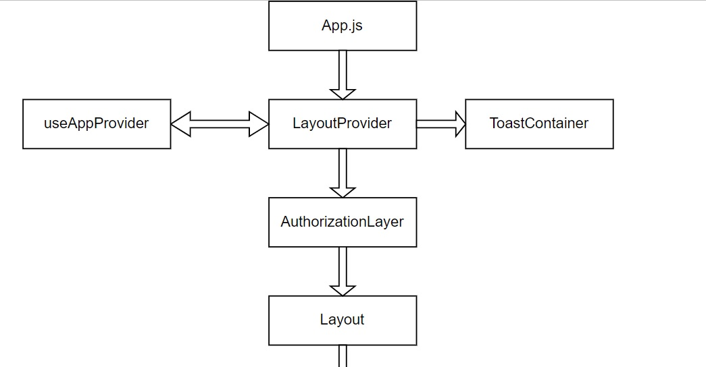
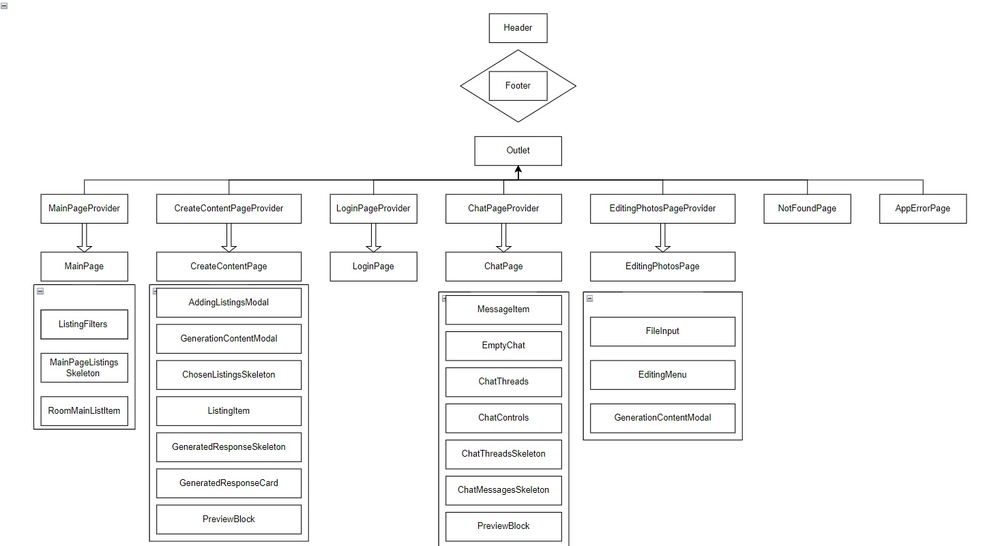
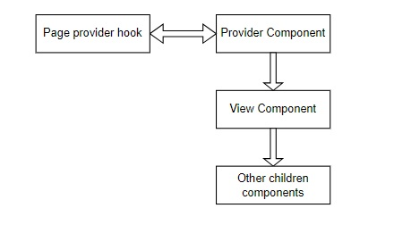
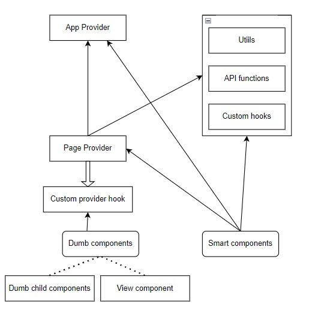

# Functional Structure and Data Flow Documentation

## Functional Structure

The application follows a structured organization with `App.js` as the starting point. It includes the following providers:
- `RouterProvider`
- `ThemeProvider`
- `QueryClientProvider`

### Router Structure

The router itself has a logical structure, with a parent route `/` that renders the `LayoutProvider` component. The `LayoutProvider` contains data for the entire application and utilizes the Context API through the `useAppProvider` hook to share data and functions with child components.

The responsibilities of the `LayoutProvider` include:
- Rendering the `Layout` component, which in turn renders `Header`, page components, and `Footer` exclusively on the main page.
- Transferring all data through the `useAppProvider` hook.
- Displaying error toasts in `ToastContainer`.
- Handling authorization information by rendering all other components inside the `AuthorizationLayer` component.

    

### Page Structure

Each page (except for `NotFound`, `Login`, and `AppErrorPage`) follows a specific structure:

Provider components include state, effects, handling functions, and the use of React Query functions or custom hooks.

## Data Flow in the Application and Components

Data sources in the application can be categorized into three layers:

### App Layer (LayoutProvider)

The App layer, represented by `LayoutProvider`, provides data and state for the entire application. It includes data such as authentication status, user preferences, and global app settings. This data is accessible to React components that are children of `LayoutProvider`.

### Page Layer (PageProvider)

The Page layer, represented by `PageProvider`, depends on data and state from the App layer and may also rely on its specific data sources like API functions or custom hooks. It acts as a mediator, managing the page's state and data requirements, and connects with child components representing different sections of the page.

### Additional Layer (Utils, API Functions, Custom Hooks)

The Additional layer includes functions, constants, API functions, and custom hooks. Data from this layer can be used throughout the application, except for cases that violate data flow rules.

## Dependencies and Connections

Dependencies and connections between the three layers (App, Page, and Additional) are crucial for establishing a smooth data flow:

### App Layer (LayoutProvider)
- Dependencies: The App layer sets up global state and provides data for child components. It may depend on various sources, such as authentication status and user preferences.
- Connections: The App layer acts as a central point for providing data and state to the entire application. It connects with various Page layers to pass down shared state and data.

### Page Layer (PageProvider)
- Dependencies: The Page layer depends on data and state provided by the App layer. It may also rely on its own specific data sources, like API functions or custom hooks.
- Connections: The Page layer connects with child components representing specific sections of the page and passes down relevant data.

### Additional Layer (Utils, API Functions, Custom Hooks)
- Dependencies: The Additional layer often depends on external APIs, utility functions, and custom hooks.
- Connections: The Additional layer can be accessed from both the App and Page layers. It acts as a resource hub for various functionalities across the application.

    

## Data Flow Rules

1. **Top-Down Data Flow**: Data should flow from top-level components (App layer) down to child components (Page layer) to maintain a clear and predictable hierarchy.
2. **App Layer as Global State Provider**: The App layer (LayoutProvider) should act as the global state provider for the entire application.
3. **Page Layer as Mediator**: Each Page layer (PageProvider) should mediate for its specific page, managing the page's state and data requirements.
4. **Correct Data and State Locations**: Data in the Page layer should not be shared with other Page components; it should be located in the App Layer if needed in multiple pages.
5. **Dumb Components**: View components should remain stateless except for local state that doesn't affect other top-level components.
6. **Smart Components**: Some components may directly take state and data from the App Provider using custom context hooks, especially if they are large and independent.
7. **Direct Data/Props**: Components in the Page layer may take data directly from Page Providers or from props based on whether they are used in other pages.
8. **Reusable Data Utilities**: The Additional layer should provide reusable data utilities and functions.
9. **Minimize Data Duplication**: Avoid duplicating data in different components or layers.
10. **Separation of Concerns**: Each layer should have a clear responsibility.
11. **Data Access via Hooks or Context**: Use React hooks or context to provide and access data between components.
12. **Consistent Naming Conventions**: Use consistent and descriptive naming conventions for data variables, functions, and components.
13. **Logical Grouping of Code Blocks**: There are different stuff in the components like variables, states, used hooks, effects, and so on. It would be more convenient to put together the same parts of the code and show where they start and end: “//@@viewOn” and “//@@viewOff”.
    You can use such groups comments for this:
    - //@@viewOn:private - for static variables before the body of a component
    - //@@viewOn:statics - for static variables inside a component body
    - //@@viewOn:hooks- for hooks group
    - //@@viewOn:handlers- for handlers functions that are created in the component
    - //@@viewOn:effects- for useEffects hooks or other similar functions
